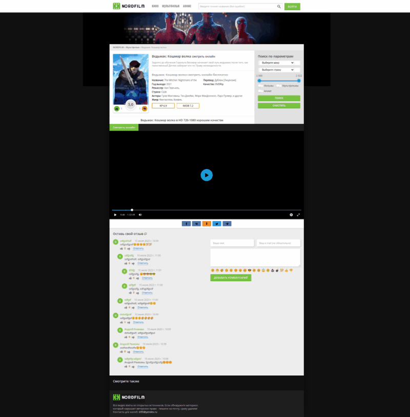

# Сайт для поиска и просмотра фильмов с возможностью коментировать, оценивать и регистрироваться

##  Запуск
### команда на линукс:
    sudo docker compose up 

  

фильмы добваляются через админ панель
[http://localhost:8000/admin/](http://localhost:8000/admin/)

Начальная страница: http://localhost:8000/movies/

Можно добавить коментарии к фильмам и оценивать их.
Исключена возможность накрутки лайков или дизлайков провекой IP с которого приходит запрос, а не через аккаунт т.к. фильмы можно оценивать без регистрации.

Есть возможность сбросить пароль через ссылку которая приходит на почту.
Email отправляестя через redis.